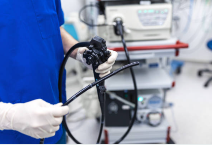

 

### A few days ago, I was sitting in a meeting where we were discussing a way to sift through patient data and properly triage their colonoscopy follow up based on their endoscopy data and histology from any polyps that were removed.  The suggestion was that this should be done manually.
### I mentioned that we should use an LLM to help with this by using RAG and entering our protocols into a vector database for retrieval.

### People suggested I build such a system...
### So I did.  It's a very basic prototype but as a proof of concept, it works

### ***Important note here - no actual patient information was used in development.  Anything resembling medical data is purely fictional that I made up***

### It was fun experimenting with this over the weekend!
### Going to leave this repo as is and move to developing a version of this prototype that can be deployed in the cloud

